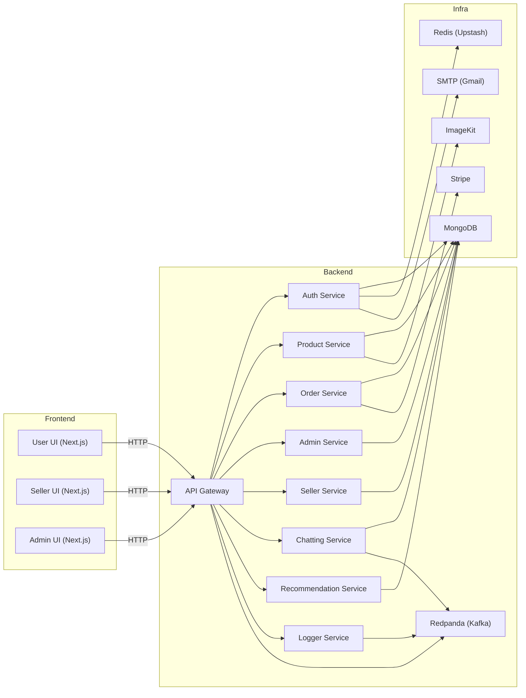
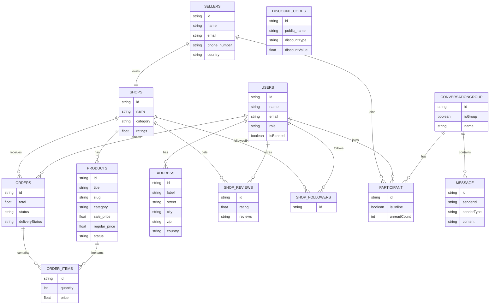
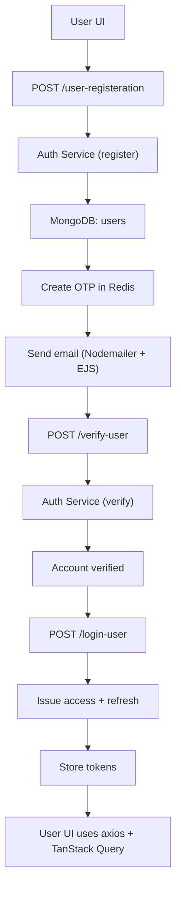
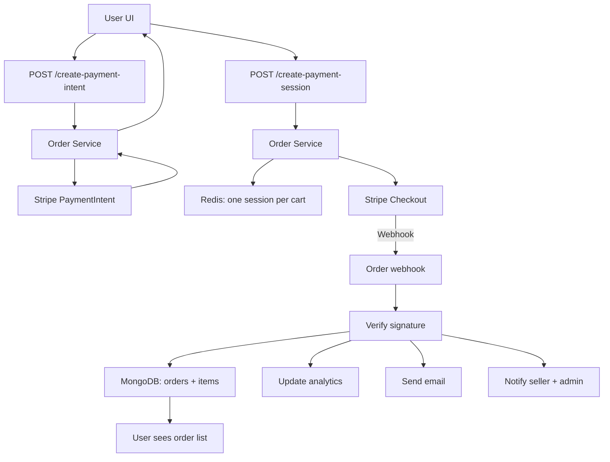
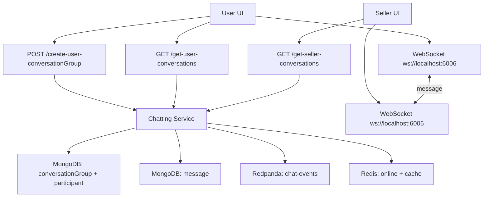
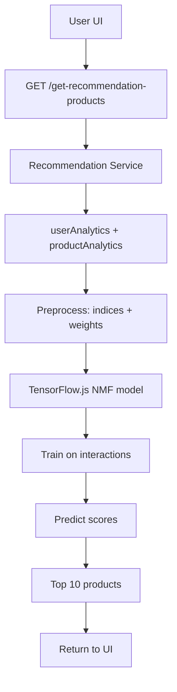

# 🛒 Full-Stack Micro-Services E-Commerce Marketplace (Nx Monorepo)

<p align="center">
  
</p>

A production-ready **multi-tenant marketplace** with:

* **User**, **Seller**, and **Admin** portals
* Microservice backend (Auth, Product, Order, Admin, Seller, Chatting, Recommendation, Logger, Kafka/Redpanda)
* **Analytics + AI recommendations** (TensorFlow.js)
* Real-time **chat**, **notifications**, **logging** and **dashboards**

> ⚠️ **Security**
> Never commit real `.env` files or secrets. Replace everything with your own safe values.

---

## 📚 Table of Contents

* [Project Structure](#project-structure)
* [Architecture](#architecture)
* [Tech Stack](#tech-stack)
* [High Level Features](#high-level-features)
* [Database & ER Diagram](#database--er-diagram)
* [Backend Services](#backend-services)
* [Authentication & Security](#authentication--security)
* [Frontends](#frontends)
* [Analytics & Recommendations](#analytics--recommendations)
* [Real-Time Chat & Logger](#real-time-chat--logger)
* [Notifications](#notifications)
* [Environment Variables](#environment-variables)
* [Running Locally](#running-locally)
* [Swagger API Docs](#swagger-api-docs)
* [Core Flows](#core-flows)
* [Development Journey](#development-journey)

---
<a id="project-structure"></a>
## 🧱 Project Structure

Nx monorepo:

```text
apps/
  admin-service/
  admin-ui/
  api-gateway/
  auth-service/
  chatting-service/
  kafka-service/
  logger-service/
  order-service/
  product-service/
  recommendation-service/
  seller-service/
  seller-ui/
  user-ui/
```

Backend = **Express services**, frontend = **Next.js**, all orchestrated with **Nx**.

---

## 🏗 Architecture



---

## 🛠 Tech Stack

**Backend**

* **Node.js**, **Express**
* Middleware: `cors`, `cookie-parser`, `morgan`, `express-rate-limit`, `express-http-proxy`, `axios`
* **Prisma** + **MongoDB**
* **Redis (Upstash)** – OTP cooldown, lockouts, sessions, cache
* **Stripe** – payment intents, sessions, webhooks
* **ImageKit** – uploads, delete, AI (Remove BG, Retouch, Drop Shadow, Upscale)
* **Nodemailer + Gmail + EJS** – email templates
* **JWT**, **crypto**, **RegExp**
* **Swagger UI** for API docs
* **Docker**
* **Kafka → Redpanda**
* **TensorFlow.js** (Node) for recommendations

**Frontend**

* **Next.js** (Nx) – `user-ui`, `seller-ui`, `admin-ui`
* **Tailwind CSS** (user)
* **styled-components + Jotai** (seller)
* **TanStack Query** & **TanStack Table**
* **React Hook Form** (`Controller`, `useFieldArray`, custom inputs)
* **React Quill**, **React Image Magnify**
* **Zustand** – cart & wishlist
* **Framer Motion**
* **ApexCharts**, **Recharts**, **react-simple-maps**
* **React Hot Toast**

**Infra & CI**

* **Nx** – dev workflows
* **Jest** – unit tests
* **GitHub Actions** – CI pipelines

---

## ✨ High Level Features

* Roles: **User / Seller / Admin**
* OTP auth, **forgot / reset password**
* JWT **access + refresh**
* Stripe payments + webhook handling
* Product, events, discount codes, shops
* Cart & wishlist (Zustand)
* Real-time **chat** (WebSocket + Redis + Kafka)
* Notifications for all roles
* TensorFlow.js **recommendation engine**
* Global logging dashboard
* Dynamic site config (categories, logo, banner)

---

## 🗃 Database & ER Diagram

Prisma models:

* Users, Sellers, Shops, Addresses
* Products, Discount Codes, Site Configs
* Orders, Order Items
* Analytics, Visitors, Followers, Reviews
* Notifications
* Conversations, Participants, Messages
* Images, Shop Settings, Blocked Sellers



---

## 🧩 Backend Services

Each service (Express):

* Global error middleware
* `morgan`, `cors`, `cookie-parser`, rate-limit
* Prisma client
* Swagger docs

**Auth Service**

* Register/login: user, seller, admin
* OTP verify, forgot/reset password
* Access, refresh, reset tokens
* Redis: OTP cooldown, spam lock, temp state
* Nodemailer + EJS templates

**Product Service**

* Init `site_configs` (categories, logo, banner) if missing
* Products & events CRUD
* Discount codes for sellers
* Filtering: page, price, category, color, size, tags
* ImageKit: base64 uploads, delete, AI transforms
* Cron: soft-delete + 24h restore window

**Order Service**

* Stripe payment intents & sessions
* Redis: **one session per cart**
* Stripe webhooks: verify, create orders, update analytics, send emails, notify seller/admin
* Seller / user / admin order APIs
* Payment success page (canvas confetti)

**Seller Service**

* Shop settings (low stock, notification channels)
* Soft delete shop + 28-day cron purge + restore
* Block deleted sellers from signing up again
* Follow/unfollow shops
* Stripe connect info
* Custom domains page (prepared for deployment)

**Admin Service**

* Admin login, no signup
* Promote user → admin
* Manage users, sellers, shops
* Ban/unban users & admins
* Manage products, events, orders, payments
* `site_configs` editor (categories, logo, banner)

**Recommendation Service**

* `/get-recommendation-products`
* Reads analytics, runs TensorFlow.js model
* Returns top-N products per user

**Logger Service**

* Receive logs from clients
* Stream logs via Kafka/Redpanda
* Admin UI: real-time logs, filters, download

**Chatting Service**

* WebSocket server: user ↔ seller chat
* Redis: online status, cached participants
* Kafka: message events
* REST endpoints: conversations, messages

---

## 🔐 Authentication & Security

* JWT access + refresh (cookies/headers)
* OTP with Redis cooldown
* Forgot/reset with OTP + reset token
* Global error handler
* Rate limiting on auth routes
* Express HTTP proxy (API gateway) in front of services

---

## 🖥 Frontends

### User UI (Next.js + Nx)

* Email/password auth + Google login
* Auth middleware using access/refresh tokens
* Shared `axiosInstance`:

  * Auto refresh
  * Retry failed requests
  * Logout on hard failure
* Tailwind UI with animations
* OTP input:

  * Backspace, arrows, auto-focus
* Product experience:

  * Hero, listing, details
  * Server-side product pages
  * SEO metadata, link previews
  * ReactImageMagnify for zoom
* Search & filters:

  * Price, categories, colors, sizes, pagination
* Cart & wishlist (Zustand)
* Profile:

  * Orders, inbox, notifications
  * Shipping addresses (add/delete)
  * Change password, settings, support
* Utilities:

  * Location caching (20 days)
  * Device info (UAParser)
* Coupons:

  * Apply coupon
  * Custom toasts (react-hot-toast)

### Seller UI (Next.js + Nx)

* styled-components + Jotai
* Seller dashboard (orders, payments, products, events)
* Order details + status updates
* Low stock alert, notifications settings
* React Hook Form with `Controller`, `useFieldArray`
* React Quill for descriptions
* ImageKit upload/delete
* TanStack Table for products (with modals)
* Custom domains page

### Admin UI (Next.js + Nx)

* Admin login + logout
* Sidebar layout
* Dashboard:

  * Sales (ApexCharts area)
  * Device usage (Recharts pie)
  * Recent orders (TanStack Table)
  * Geomap (react-simple-maps + Framer Motion)
* Management pages:

  * Orders, payments, products (CSV export)
  * Events, users (ban/unban), sellers/shops
  * Admins management
  * Customization (categories, logo, banner from ImageKit)
* Banner/logo are dynamic and used in user UI

---

## 📊 Analytics & Recommendations

* Events:

  * Product views, add to cart, wishlist, shop visits, purchases
* Stored in:

  * `userAnalytics`
  * `productAnalytics`
  * `shopAnalytics`
  * `uniqueShopVisitors`
* Redpanda instead of Confluent (free Kafka-compatible)

**Recommendation Engine (TensorFlow.js)**

1. Load user history
2. Map users/products → indices
3. Neural Matrix Factorization model (embeddings)
4. Weight actions (view < wishlist < cart < purchase)
5. Train and predict scores
6. Return top 10 products

---

## 💬 Real-Time Chat & Logger

### Chat

* WebSocket server (`ws://localhost:6006`)
* Redis: presence & conversation cache
* Kafka/Redpanda: chat events
* Consumers with:

  * 3s buffers
  * Backoff & partition handling
* UI: emojis, images, messages, real-time conversations

### Logger

* Logs: success, error, warning, debug, info
* Kafka → Logger Service → WebSocket to Admin UI
* Admins can filter & download logs

---

## 🔔 Notifications

* `notifications` model: `creatorId`, `receiverId`, `title`, `message`, `redirect_link`, `isRead`
* Used for:

  * New orders & status updates
  * Payment success
  * Admin & seller alerts
* APIs:

  * Get notifications
  * Mark as read
* Integrated in user, seller, admin UIs

---

## 🌱 Environment Variables

> Templates only. Do **not** commit real values.

### Root `main.env`

```env
NODE_ENV="development"

DATABASE_URL="mongodb+srv://<DB_USER>:<DB_PASSWORD>@<HOST>/<DB_NAME>"

REDIS_URL="rediss://default:<REDIS_PASSWORD>@<REDIS_HOST>:6379"

SMTP_HOST=smtp.gmail.com
SMTP_PORT=465
SMTP_SERVICE=gmail
SMTP_USER="<your_smtp_user>@gmail.com"
SMTP_PASS="<your_app_password>"

REFRESH_TOKEN_SECRET="<refresh_secret>"
ACCESS_TOKEN_SECRET="<access_secret>"

STRIPE_SECRET_KEY="sk_test_..."
STRIPE_WEBHOOK_SECRET="whsec_..."

IMAGEKIT_PUBLIC_KEY="<imagekit_public_key>"
IMAGEKIT_PRIVATE_KEY="<imagekit_private_key>"

REDPANDA_BROKERS="<broker-host:9092>"
REDPANDA_USERNAME="<kafka_username>"
REDPANDA_PASSWORD="<kafka_password>"
```

### `apps/user-ui/.env`

```env
NEXT_PUBLIC_SERVER_URI="http://localhost:8080"
NEXT_PUBLIC_SELLER_SERVER_URI="http://localhost:3001"
NEXT_PUBLIC_CHATTING_WEBSOCKET_URI="ws://localhost:6006"
NEXT_PUBLIC_STRIPE_PUBLIC_KEY="pk_test_..."
```

### `apps/seller-ui/.env`

```env
NEXT_PUBLIC_SERVER_URI="http://localhost:8080"
NEXT_PUBLIC_USER_UI_LINK="http://localhost:3000"
NEXT_PUBLIC_CHATTING_WEBSOCKET_URI="ws://localhost:6006"
```

### `apps/admin-ui/.env`

```env
NEXT_PUBLIC_SERVER_URI="http://localhost:8080"
NEXT_PUBLIC_USER_UI_LINK="http://localhost:3000"
NEXT_PUBLIC_SELLER_UI_LINK="http://localhost:3001"
NEXT_PUBLIC_SOCKET_URI="ws://localhost:6008"
```

---

## ▶️ Running Locally

1. **Install deps**

   ```bash
   npm install
   # or
   pnpm install
   ```

2. **Configure envs**

   * `main.env` at root
   * `.env` in:

     * `apps/user-ui`
     * `apps/seller-ui`
     * `apps/admin-ui`

3. **Prisma + DB**

   ```bash
   npx prisma generate
   npx prisma db push
   ```

4. **Start backend services**

   ```bash
   npm run dev
   # nx run-many --target=serve --all
   ```

5. **Start frontends**

   ```bash
   npm run user-ui
   npm run seller-ui
   npm run admin-ui
   ```

6. **Run tests**

   ```bash
   nx test auth-service
   nx test product-service
   # or
   npm test
   ```

---

## 📜 Swagger API Docs

```bash
npm run auth-docs
npm run product-docs
npm run order-docs
npm run admin-docs
npm run seller-docs
npm run chatting-docs
```

Open the URLs printed in the console (usually `/docs` or `/swagger`).

---

## 🔄 Core Flows

### User Registration & OTP Flow



---

### Order Creation & Payments Flow



---

### Chatting Flow



---

### Recommendations Flow



---

## 🧭 Development Journey

1. Nx monorepo, Prisma + MongoDB
2. Auth (OTP, JWT, Redis), emails with Nodemailer + EJS
3. Product service, `initializeSiteConfigs`, ImageKit + AI transforms
4. Discount codes, offers/events
5. User UI: animated auth, OTP, SEO product pages, cart & wishlist, coupons
6. Seller UI: styled-components + Jotai, products/orders, low stock, Stripe connect
7. Order service: payment intents/sessions, Redis session lock, webhook handling, confetti success
8. Admin panel: dashboards, charts, maps, CSV exports, full management
9. Chat, notifications, logger service with Kafka + WebSockets
10. Redpanda migration, analytics models
11. TensorFlow.js recommendation engine + hardening (errors, rate limits, Jest, CI, Docker)


