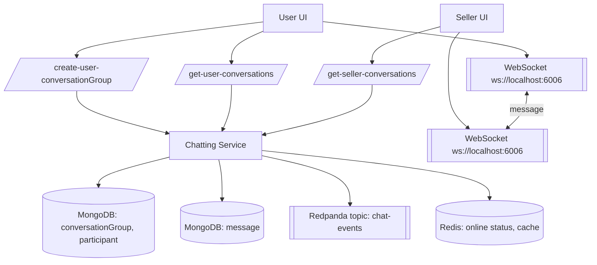
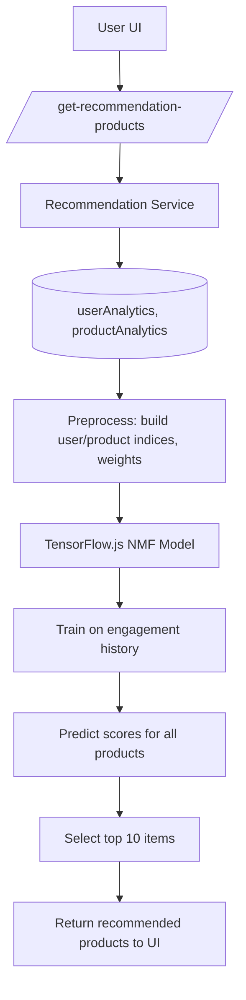

# 🛒 Full-Stack E-Commerce Marketplace (Nx Monorepo)

 

A production-oriented **multi-tenant marketplace** with:

- Separate **User**, **Seller**, and **Admin** portals
- Microservice backend (Auth, Product, Order, Admin, Seller, Chatting, Recommendation, Logger, Kafka/Redpanda)
- **Analytics + AI recommendations** powered by TensorFlow.js
- Real-time **chat**, **notifications**, **logging** and **dashboards**

> ⚠️ **Security reminder**  
> Never commit real `.env` files or secrets. All credentials below must be replaced with your own safe values.

---

## 📚 Table of Contents

- [Project Structure](#project-structure)
- [Tech Stack](#tech-stack)
- [Monorepo, Tooling & CI](#monorepo-tooling--ci)
- [High Level Features](#high-level-features)
- [Architecture](#architecture)
- [Database & ER Diagram](#database--er-diagram)
- [Backend Services & Features](#backend-services--features)
- [Authentication & Security](#authentication--security)
- [Frontends](#frontends)
  - [User UI](#user-ui-nextjs--nx)
  - [Seller UI](#seller-ui-nextjs--nx)
  - [Admin UI](#admin-ui-nextjs--nx)
- [Analytics, Kafka/Redpanda & Recommendations](#analytics-kafkaredpanda---recommendations)
- [Real-Time Chat & Logger Service](#real-time-chat---logger-service)
- [Notifications System](#notifications-system)
- [Environment Variables](#environment-variables)
- [Running Locally](#running-locally)
- [Swagger API Docs](#swagger-api-docs)
- [Core Flows](#core-flows)
  - [User Registration & OTP Flow](#user-registration--otp-flow)
  - [Order Creation & Payments Flow](#order-creation--payments-flow)
  - [Chatting Flow](#chatting-flow)
  - [Recommendations Flow](#recommendations-flow)
- [Development Journey & Milestones](#development-journey--milestones)

---

## 🧱 Project Structure

Monorepo managed by **Nx**:

```text
apps/
  admin-service/
  admin-ui/
  api-gateway/
  api-gateway-e2e/
  auth-service/
  auth-service-e2e/
  chatting-service/
  kafka-service/
  logger-service/
  order-service/
  product-service/
  recommendation-service/
  seller-service/
  seller-ui/
  user-ui/
````

Backend apps are **Express services**, frontend apps are **Next.js** UIs, all orchestrated with Nx.

---

## 🛠 Tech Stack

**Backend**

* **Node.js**, **Express**
* Middleware: `cors`, `cookie-parser`, `morgan`, `express-rate-limit`, `express-http-proxy`, `axios`
* **Prisma** ORM + **MongoDB**
* **Redis (Upstash)** for caching, OTP cooldown, spam locking & session-like flows
* **Stripe** for payments
* **ImageKit** for media storage & AI enhancements (Remove BG, Retouch, Drop Shadow, Upscale)
* **Nodemailer + Gmail + EJS** for email templates
* **JWT** for access / refresh / reset tokens
* **Crypto + RegExp** for validation and secure token generation
* **Swagger / swagger-ui** for API docs
* **Docker** for containerization
* **Kafka → Redpanda** for analytics events, chat, logs, and recommendations
* **TensorFlow.js** (Node) for real-time recommendation model

**Frontend**

* **Next.js** (via Nx) for `user-ui`, `seller-ui`, `admin-ui`
* **Tailwind CSS** for user UI styling
* **Styled-components** + **Jotai** for seller dashboard
* **TanStack Query** (React Query) for data fetching
* **TanStack Table** for data-heavy tables
* **React Hook Form** with `Controller`, `useFieldArray`, custom `<Input />` and `<Textarea />`
* **React Quill** for rich text editing
* **React Image Magnify** for zoomable product images
* **Zustand** for cart & wishlist global state
* **Framer Motion** for animations & transitions
* **ApexCharts**, **Recharts**, **react-simple-maps** for dashboards
* **React Hot Toast** for notifications

**Infra & Ops**

* **Nx** for dev tools, targets & execution
* **Jest** for unit testing
* **GitHub Actions** for CI (tests, linting, etc.)
* **Redis (Upstash)** as managed cache
* **Redpanda** cluster as Kafka-compatible event bus

---

## 🧰 Monorepo, Tooling & CI

* **Nx Monorepo**

  * Shared libraries (middleware, utils, types) across services
  * Targets like `serve`, `test`, `build` through Nx
* **Testing**

  * **Jest** for unit tests in services and shared libs
  * Test scripts wired into **GitHub Actions** for PR & main branch checks
* **Docker**

  * Each service and UI can be containerized
  * Suitable for local multi-container setups and deployment
* **Swagger Codegen**

  * Per-service Swagger definitions via scripts:

    * `auth-docs`, `product-docs`, `order-docs`, `admin-docs`, `seller-docs`, `chatting-docs`

---

## ✨ High Level Features

* Multi-role authentication: **user / seller / admin**
* OTP-based verification + **forgot/reset password**
* **JWT access & refresh** tokens, secure cookie handling
* User, seller, and admin dashboards with **real analytics**
* Full **order flow** with Stripe payment intent + checkout sessions
* **Cart & Wishlist** state with persistence (Zustand)
* **Product management** (create, update, soft delete, restore, scheduled deletion)
* **Offers & events**, discount codes, top shops, advanced filtering & search
* **Real-time chat** between users & sellers (WebSockets) with Kafka & Redis
* **Notifications** across user, seller & admin
* **AI-powered recommendations** using TensorFlow.js (Neural Matrix Factorization)
* **Global logging system** streamed to admins
* **Dynamic site customization**: categories, subcategories, banners, logos

---

## 🏗 Architecture

```mermaid
flowchart LR
    subgraph Frontend
        UUI[User UI (Next.js)]
        SUI[Seller UI (Next.js)]
        AUI[Admin UI (Next.js)]
    end

    subgraph Backend
        APIGW[API Gateway (Express HTTP Proxy)]

        AUTH[Auth Service]
        PROD[Product Service]
        ORDER[Order Service]
        ADMIN[Admin Service]
        SELLER[Seller Service]
        CHAT[Chatting Service]
        RECO[Recommendation Service]
        LOG[Logger Service]
        KAFKA[Redpanda (Kafka-compatible)]
    end

    subgraph Infra
        MONGO[(MongoDB)]
        REDIS[(Redis - Upstash)]
        STRIPE[Stripe]
        SMTP[SMTP (Gmail)]
        IMG[ImageKit]
    end

    UUI -->|HTTP| APIGW
    SUI -->|HTTP| APIGW
    AUI -->|HTTP| APIGW

    APIGW --> AUTH
    APIGW --> PROD
    APIGW --> ORDER
    APIGW --> ADMIN
    APIGW --> SELLER
    APIGW --> CHAT
    APIGW --> RECO
    APIGW --> LOG

    AUTH --> MONGO
    PROD --> MONGO
    ORDER --> MONGO
    ADMIN --> MONGO
    SELLER --> MONGO
    CHAT --> MONGO
    RECO --> MONGO

    AUTH --> REDIS
    ORDER --> STRIPE
    PROD --> IMG
    APIGW --> KAFKA
    CHAT --> KAFKA
    LOG --> KAFKA

    AUTH --> SMTP
```

---

## 🗃 Database & ER Diagram

Prisma schema targets **MongoDB** and models:

* Users, Sellers, Shops, Addresses
* Products, Discount Codes, Site Configs
* Orders, Order Items
* Analytics & Visitors
* Followers, Reviews, Notifications
* Conversations, Participants, Messages
* Images & Shop Settings
* Blocked Seller Emails


---

## 🧩 Backend Services & Features

Each service is an Express app with:

* **Global error middleware**
* Request logging with **morgan**
* **Rate limiting**
* **CORS**
* JSON body parsing & **cookie-parser**
* Typed **Prisma client**
* Swagger docs

### Auth Service

* Registration + login for:

  * `user`, `seller`, `admin`
* Email/OTP verification
* Forgot + reset password via OTP and reset token
* Secure JWT:

  * Access token
  * Refresh token
  * Reset token
* **Redis (Upstash)** for:

  * OTP cooldown
  * Spam protection & lockouts
  * Temporary verification state
* Uses **crypto** & **regex** for strong password and email validation
* Sends **EJS email templates** through **Nodemailer + Gmail**
* Exposes `/user-registeration`, `/seller-registeration`, `/login-*`, `/verify-*`, `/refresh-token`, `/logout`, address APIs and more.

### Product Service

* Auto **initialize site configs** if missing (categories, subcategories, logo, banner)
* CRUD for products & events
* **Discount codes** feature for sellers
* Advanced filtering:

  * Pagination, price range, categories, colors, sizes
  * Search endpoints (querying on title, tags, brand, etc.)
* **ImageKit integration**

  * Files converted to base64 on upload
  * Upload & delete from ImageKit storage
  * AI transformations: Remove BG, Retouch, Drop Shadow, Upscale
* Cron job:

  * Soft delete products & schedule permanent deletion after 24 hours
  * Allow restore within 24h

### Order Service

* **Payment intent** and **custom payment session** creation with Stripe
* Uses Redis cache so a user can only have **one payment session per cart**
* Handles Stripe webhooks to:

  * Verify events
  * Create corresponding orders
  * Update product & user analytics
  * Send confirmation emails
  * Notify seller & admin
* Exposes order APIs for **user**, **seller**, and **admin**
* Payment success flow with a dedicated UI page and **canvas confetti**

### Seller Service

* Shop settings:

  * Low stock alerts
  * Notification preferences (email, app, web)
* Shop lifecycle:

  * Delete shop (soft delete)
  * Cron job to **permanently delete after 28 days**
  * Ability to restore before deadline
  * Block sellers who delete their shop from re-signing up
* Features:

  * View products/events for a shop
  * Shop follow / unfollow
  * Stripe connect status and info
  * Placeholder for custom domains management

### Admin Service

* Admin login (no public signup)
* Admin management:

  * Promote a user to admin
  * View all admins
* User/seller/shop management:

  * List users, sellers, admins, shops
  * Ban/unban users and admins
* Product/event/user/order/payment management
* Customizations (`site_configs`):

  * categories & subcategories
  * logo & banner (stored in ImageKit, displayed in User UI)
* Notifications for admins

### Recommendation Service

* Exposes `/get-recommendation-products` for logged-in user
* Reads analytics from DB (views, wishlist, cart, purchases)
* Runs **TensorFlow.js** model to generate top-N recommendations (see [Recommendations Flow](#recommendations-flow)).

### Logger Service

* Receives logs via HTTP/WebSocket
* Publishes log events (success, error, warning, debug, info) to Kafka/Redpanda
* Admin UI:

  * Real-time streaming of logs
  * Filter by type
  * Download logs

### Chatting Service

* WebSocket server for:

  * Online status via Redis
  * Real-time user ↔ seller messages
* Persists:

  * `conversationGroup`, `participant`, `message`
* Publishes message events to Kafka/Redpanda
* Consumer logic:

  * Consumption buffers with 3s delays
  * Backoff, partitioning, offsets, and failure handling
* Provides REST endpoints for listing conversations & messages

---

## 🔐 Authentication & Security

* **Access & Refresh tokens** (JWT)

  * Short-lived access token stored in HTTP-only cookies / headers
  * Refresh token with rotation and revocation strategies
* **OTP verification**

  * Per-email OTP stored temporarily in Redis with cooldown
  * **Regex** ensures strong OTP + email format validation
* **Forgot / Reset password**

  * OTP verification + **reset JWT token**
* **Global error handler** catches all thrown errors and formats API responses
* Uses **express-rate-limit** to protect login and auth endpoints
* **Express HTTP Proxy** used by the API gateway to route traffic to the right service

---

## 🖥 Frontends

### User UI (Next.js + Nx)

* Authentication:

  * Login & Signup with **email/password**
  * **Google OAuth** support
  * Middleware to guard routes based on `access_token` & `refresh_token`
  * Shared `axiosInstance` that:

    * Automatically refreshes tokens
    * Queues & retries failed requests
    * Logs out on permanent failure
* UI & UX:

  * Tailwind CSS
  * Auth pages with animations
  * Custom OTP component:

    * Handles **Backspace**, **ArrowLeft**, **ArrowRight**, auto-focus, etc.
* Product Experience:

  * Hero section
  * Product listing, cards & details
  * Server-side product pages (`getServerSideProps` / route handlers)
  * **Metadata** for SEO + link previews (Twitter, etc.)
  * **ReactImageMagnify** for zoomable images
* Search & Filters:

  * Advanced search with backend filters: price range, categories, colors, sizes
  * Offers & shops pages with filters + pagination
* Cart & Wishlist:

  * **Zustand** store for cart and wishlist
  * UI components to view and manage them
* Profile & Account:

  * Orders info & “My Orders”
  * Inbox (chat entry), notifications
  * Shipping addresses: add / delete / list
  * Change password
  * Referral program highlights, badges, account settings, billing history & support center
  * Logout
* Utilities:

  * Custom components to get and **cache location for 20 days**
  * Device info detection via **UAParser**
* Data fetching:

  * **TanStack Query** providers and hooks for all key flows
* Coupons:

  * Apply coupon in orders
  * Improved toasts using **react-hot-toast**

### Seller UI (Next.js + Nx)

* Tech:

  * **styled-components** + **Jotai** for sidebar and global dashboard state
  * TanStack Query for data fetching

* Seller Dashboard:

  * Same dashboard style as admin (but scoped to one shop)
  * Orders and payments pages
  * Order details page with status updates and detailed info
  * Products & events management
  * Low stock alerts
  * Notification settings: email / app / web toggles
  * Custom domains page (prepared for deployment)

* Forms:

  * **React Hook Form** with:

    * `Controller`, `useFieldArray` (append/remove)
    * Custom `<Input>` and `<Textarea>` components

* Product management UI:

  * Rich text descriptions via **React Quill**
  * ImageKit uploads and deletes
  * TanStack Table: list all shop products, delete/create via modals

### Admin UI (Next.js + Nx)

* Authentication:

  * Admin login only (no signup)
  * Logout logic for admins
* Layout:

  * Sidebar navigation, dashboard, and resource pages
* Dashboard Widgets:

  * **Sales chart**: ApexCharts (area chart)
  * **Device usage**: Recharts (`Pie`, `Cell`, `Tooltip`, `Legend`, `ResponsiveContainer`)
  * **Recent orders table**: TanStack React Table
  * **Geomap**: `ComposableMap`, `Geographies`, `Geography` from `react-simple-maps` + **Framer Motion** (`motion`, `AnimatePresence`)
* Management Pages:

  * Orders & order details
  * Payments
  * Products with **Export to CSV**
  * Events
  * Users (ban/unban)
  * Sellers & shops overview
  * Admin management (promote users to admins)
  * Customizations (site configs – categories, subcategories, logo & banner shown via ImageKit)
* Dynamic assets:

  * Banner & logo loaded from backend site config so the User UI is always in sync.

---

## 📊 Analytics, Kafka/Redpanda & Recommendations

* Switched from **Confluent Kafka** to **Redpanda** for a free, Kafka-compatible cluster
* Events pushed:

  * Product views
  * Add to cart
  * Add to wishlist
  * Shop visits
  * Purchases
* Stored in:

  * `userAnalytics`
  * `productAnalytics`
  * `shopAnalytics`
  * `uniqueShopVisitors`

### Recommendation Engine (TensorFlow.js)

1. Fetch user interaction history from DB
2. Convert users & products to numerical indices
3. Build **Neural Matrix Factorization** model:

   * Embedding layer for users
   * Embedding layer for products
4. Assign weights based on engagement (views < wishlist < cart < purchase)
5. Train model to learn preferences
6. Predict score for all products
7. Return **top 10** highest-scoring products

---

## 💬 Real-Time Chat & Logger Service

### Chat

* WebSocket server listens for:

  * New messages
  * Mark-as-seen events
  * Typing / online presence
* Uses **Redis** to:

  * Track online users/sellers
  * Cache user/seller + conversation IDs
* Kafka / Redpanda:

  * Chat events produced into topics
  * Consumers with:

    * 3s buffer per consume
    * Backoff & partition handling
    * Memory-safe offset processing
* UI:

  * Full real-time chat in User & Seller UIs
  * Send emojis, images & text
  * Conversations list and messages view

### Logger

* Client apps emit logs (success, error, warning, debug, info)
* Logs go via **Kafka/Redpanda** to **Logger Service**
* Admins:

  * See real-time logs via WebSocket
  * Filter by type
  * Download logs

---

## 🔔 Notifications System

* **Model `notifications`**:

  * `creatorId`, `receiverId`, `title`, `message`, `redirect_link`, `isRead`
* Used for:

  * Orders (order created, status updates)
  * Admin & seller alerts
  * Payment success events
* Fully integrated in:

  * User UI
  * Seller UI
  * Admin UI
* APIs:

  * Get notifications
  * Mark as read
  * Admin & seller specific notification feeds

---

## 🌱 Environment Variables

> These are templates. Replace with your own values and **do not commit** them.

### Root `main.env`

```env
NODE_ENV="development"

DATABASE_URL="mongodb+srv://<DB_USER>:<DB_PASSWORD>@<HOST>/<DB_NAME>"

REDIS_URL="rediss://default:<REDIS_PASSWORD>@<REDIS_HOST>:6379"

SMTP_HOST=smtp.gmail.com
SMTP_PORT=465
SMTP_SERVICE=gmail
SMTP_USER="<your_smtp_user>@gmail.com"
SMTP_PASS="<your_app_password>"

REFRESH_TOKEN_SECRET="<strong_random_refresh_secret>"
ACCESS_TOKEN_SECRET="<strong_random_access_secret>"

STRIPE_SECRET_KEY="sk_test_..."
STRIPE_WEBHOOK_SECRET="whsec_..."

IMAGEKIT_PUBLIC_KEY="<imagekit_public_key>"
IMAGEKIT_PRIVATE_KEY="<imagekit_private_key>"

REDPANDA_BROKERS="<broker-host:9092>"
REDPANDA_USERNAME="<kafka_username>"
REDPANDA_PASSWORD="<kafka_password>"
```

### `apps/user-ui/.env`

```env
NEXT_PUBLIC_SERVER_URI="http://localhost:8080"
NEXT_PUBLIC_SELLER_SERVER_URI="http://localhost:3001"
NEXT_PUBLIC_CHATTING_WEBSOCKET_URI="ws://localhost:6006"
NEXT_PUBLIC_STRIPE_PUBLIC_KEY="pk_test_..."
```

### `apps/seller-ui/.env`

```env
NEXT_PUBLIC_SERVER_URI="http://localhost:8080"
NEXT_PUBLIC_USER_UI_LINK="http://localhost:3000"
NEXT_PUBLIC_CHATTING_WEBSOCKET_URI="ws://localhost:6006"
```

### `apps/admin-ui/.env`

```env
NEXT_PUBLIC_SERVER_URI="http://localhost:8080"
NEXT_PUBLIC_USER_UI_LINK="http://localhost:3000"
NEXT_PUBLIC_SELLER_UI_LINK="http://localhost:3001"
NEXT_PUBLIC_SOCKET_URI="ws://localhost:6008"
```

---

## ▶️ Running Locally

### 1. Install Dependencies

```bash
npm install
# or
pnpm install
```

### 2. Configure Envs

* Create `main.env` at project root (or where services load envs).
* Create `.env` in:

  * `apps/user-ui`
  * `apps/seller-ui`
  * `apps/admin-ui`

### 3. Prisma Schema & DB

```bash
npx prisma generate
npx prisma db push    # push schema to MongoDB
```

### 4. Start All Backend Services

```bash
npm run dev
# => nx run-many --target=serve --all
```

### 5. Start Frontends

```bash
npm run user-ui
npm run seller-ui
npm run admin-ui
```

### 6. Run Tests

```bash
# Example – adjust to your workspace
nx test auth-service
nx test product-service
# or project-wide
npm test
```

---

## 📜 Swagger API Docs

Each service has a swagger script:

```bash
npm run auth-docs
npm run product-docs
npm run order-docs
npm run admin-docs
npm run seller-docs
npm run chatting-docs
```

Open the URL printed in the console (usually `/docs` or `/swagger`).

---

## 🔄 Core Flows

### User Registration & OTP Flow

```mermaid
flowchart TD
    A[User UI] --> B[/user-registeration/]
    B --> C[Auth Service - RegisterUser]
    C --> D[(MongoDB: users)]
    D --> E[Generate OTP + store in Redis (cooldown)]
    E --> F[Send verification email via Nodemailer + EJS]
    F --> G[User submits /verify-user with OTP]
    G --> H[Auth Service - verifyUser (check Redis, regex)]
    H --> I[Account verified]

    I --> J[User logs in /login-user]
    J --> K[JWT access + refresh tokens issued]
    K --> L[Tokens stored (cookies/headers)]
    L --> M[User UI uses axiosInstance + TanStack Query]
```

---

### Order Creation & Payments Flow

```mermaid
flowchart TD
    U[User UI] --> PI[/create-payment-intent/]
    PI --> OS[Order Service - createPaymentIntent]
    OS --> STRIPE[Stripe PaymentIntent]
    STRIPE --> OS
    OS --> U

    U --> PS[/create-payment-session/]
    PS --> OS2[createPaymentSession]
    OS2 --> REDISC[Redis cache: one session per cart]
    OS2 --> STRIPE2[Stripe Checkout Session]

    STRIPE2 -->|Webhook| WH[Order Service Webhook]
    WH --> V[Verify event signature]
    V --> ORD[(MongoDB: orders, orderItems)]
    V --> ANA[(Analytics: productAnalytics, userAnalytics)]
    V --> MAIL[Send emails (Nodemailer)]
    V --> NOTIF[Create notifications for seller + admin]

    ORD --> U2[User sees order in /get-user-orders]
```

---

### Chatting Flow



---

### Recommendations Flow



---

## 🧭 Development Journey & Milestones

A (short) story of the repo’s evolution:

1. **Monorepo Setup**

   * Created Nx workspace, structured services & UIs.
   * Set up Prisma with MongoDB, `npx prisma db push`.
2. **Core Auth & User Flow**

   * Implemented registration, OTP verification, login, forgot/reset password.
   * Redis-backed OTP cooldown and spam protection.
   * Nodemailer + Gmail with EJS templates for emails.
3. **Product & Site Config**

   * `initializeSiteConfigs` bootstraps categories & subcategories.
   * Product service with rich text (React Quill), ImageKit uploads & AI transformations.
4. **Discounts & Offers**

   * Added discount codes and offers/events for sellers.
5. **User UI Experience**

   * Tailwind + animated login/signup + OTP component.
   * Product hero, list, details, SSR SEO metadata, ReactImageMagnify.
   * Cart & wishlist with Zustand; coupons; improved toasts.
6. **Seller Dashboard**

   * Seller UI with styled-components + Jotai.
   * Product & orders pages, low stock alerts, Stripe connect integration.
7. **Order Service & Payments**

   * Stripe payment intent & sessions with Redis locking per cart.
   * Webhooks for order creation, analytics, notifications & emails.
   * Payment success UX with canvas confetti.
8. **Admin Panel**

   * Admin login, dashboard cards & charts, maps, tables, CSV export.
   * Full management for users, sellers, products, events, orders, payments.
   * Site customization (logo, banner, categories) surfacing into user UI.
9. **Messaging, Notifications & Logging**

   * Real-time chat (WebSockets + Redis + Kafka).
   * Full notification system across roles.
   * Logger service with Kafka streaming and admin console.
10. **Analytics & AI**

    * Switched from Confluent to Redpanda.
    * Captured engagement events (views, cart, wishlist, visits, purchases).
    * Built TensorFlow.js recommendation engine with Neural Matrix Factorization.
11. **Polish & Hardening**

    * Global error middleware.
    * Rate limiting & proxying via API gateway.
    * Jest tests and CI with GitHub Actions.
    * Dockerization and environment hardening.

```
```

